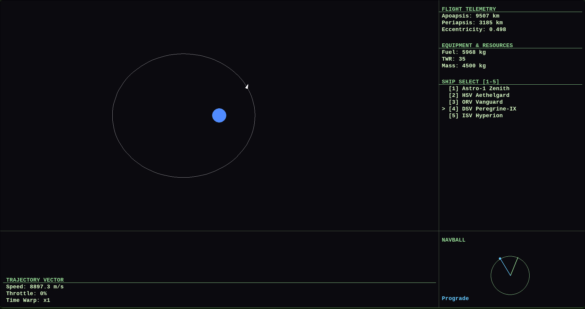

# 🛰️ Pvyle Vector Orbital Engine

> A 2D orbital mechanics simulator with live trajectory prediction and a Mission Control-style interface.




You fly a ship around a planet, burn fuel, change your orbit, and watch the ellipse update in real time. Ship heading is independent of the velocity vector, so you point where you want and burn, like in a real spacecraft. Nothing is scripted: the orbit line is recomputed every frame from the ship's position and velocity.

## Features

- **Gravity simulation** with a velocity Verlet integrator and adaptive sub-stepping, so orbits stay stable even at high time warp
- **Live orbital elements**: apoapsis, periapsis, eccentricity, all derived from state vectors
- **Orbit ellipse rendering** that reshapes instantly after every burn
- **Free rotation and thrust**: the ship turns with angular inertia, and thrust always goes where the nose points
- **Realistic mass model**: fuel burns off, the ship gets lighter, acceleration rises as the tank empties
- **5 ship presets** ranging from a light 680 kg probe to a 30-tonne heavy cruiser
- **Time warp** from x1 up to x100000
- **Pan and zoom** camera
- **Mission Control UI** with telemetry, resources, ship selection and trajectory panels
- **Real-world scale**: 1 pixel = 10.6 km (about 1:10 Earth), start orbit at ~7.8 km/s

## How it works

The interesting part is that the orbit is not simulated forward, it is solved directly from where the ship is right now.

1. **State vectors → orbit.** From position `r` and velocity `v` the engine computes the specific orbital energy `ε = v²/2 − μ/r`, which gives the semi-major axis `a = −μ / 2ε`.
2. **Eccentricity.** Using angular momentum `h = r × v`, then `e = √(1 + 2εh²/μ²)`.
3. **Orientation.** The eccentricity vector points at periapsis, which sets how the ellipse is rotated.
4. **Drawing.** The ellipse is sampled as 100 points, rotated, shifted so the planet sits at a focus, and projected to the screen.

Integration is velocity Verlet, which conserves energy far better than plain Euler, the reason a circular orbit stays circular. When time warp pushes a frame's step above 0.5 s, it is split into smaller sub-steps.

## Getting started

```bash
git clone https://github.com/pvyle0/<repo-name>.git
cd <repo-name>
pip install pygame
python main.py
```

Requires Python 3.10+ and a display. The UI is laid out for a 1900×1000 window (change `WIDTH` / `HEIGHT` in `settings.py` for smaller screens).

## Controls

| Key | Action |
|---|---|
| `Z` / `X` | Full throttle / cut throttle |
| `Left Shift` / `Left Ctrl` | Increase / decrease throttle |
| `←` / `→` | Rotate ship |
| `.` / `,` | Increase / decrease time warp |
| `1` – `5` | Switch ship (resets the flight) |
| Mouse wheel | Zoom |
| Middle mouse drag | Pan camera |

## Ships

| # | Ship | Dry mass | Fuel | Burn rate |
|---|---|---|---|---|
| 1 | Astro-1 Zenith | 500 kg | 180 kg | 3 kg/s |
| 2 | HSV Aethelgard | 1 800 kg | 1 200 kg | 8 kg/s |
| 3 | ORV Vanguard | 2 400 kg | 2 500 kg | 8 kg/s |
| 4 | DSV Peregrine-IX | 4 500 kg | 6 000 kg | 10 kg/s |
| 5 | ISV Hyperion | 12 000 kg | 18 000 kg | 20 kg/s |

Presets live in `ships_data.py`, so adding your own ship is one line.

## Project structure

```
main.py         # game loop, input, camera, HUD assembly
physics.py      # gravity, Verlet integration, orbital elements, orbit points
ship.py         # ship state, thrust, fuel, rotation, drawing
ships_data.py   # ship presets
ui.py           # panels, grid, navball stub, world→screen transform
settings.py     # constants: scale, G, window size, time warp levels
```

## Status

Early stage. The core loop (physics, ships, orbit prediction, UI) works. The navball is currently a visual stub showing only heading and prograde, and there is a single celestial body for now.

## Why this project

I built it to get hands-on with Python/OOP and orbital mechanics fundamentals: turning state vectors into orbital elements, numerical integration under gravity, and coordinate transforms between world and screen.
